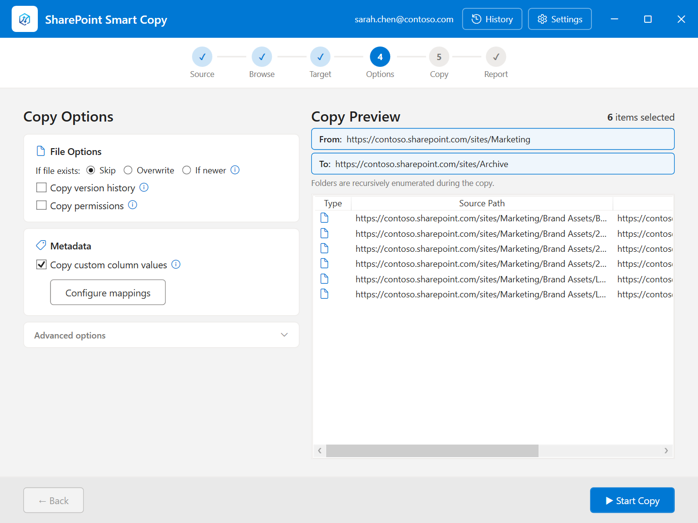

# SharePoint Smart Copy — WPF Desktop App

   

A free and open source Windows desktop application for copying files, libraries, and pages between SharePoint Online site collections — preserving version history, metadata, and custom columns.

  

---

## Screenshots

| | |
|---|---|
|  |  |
| **Browse — choose scope and select files** | **Options — versions, metadata, advanced** |
|  |  |
| **Options — with version history enabled** | **Report — per-file results and CSV export** |
|  |  |
| **Progress — real-time file status** | **History — browse previous runs** |

---

## Installation (No Build Required)

1. **Download** the latest `.exe` from the [Releases page](https://github.com/sregan1/SharePoint-Smart-Copy/releases/latest) — it is a self-contained single-file binary, no extraction needed.
2. **Register an Azure AD app** — follow the [Azure AD App Registration](#azure-ad-app-registration) steps below to create an app registration in your tenant.
3. **Launch** `SharePointSmartCopy.exe`, open **Settings** (⚙ top-right), and enter your Client ID and Tenant ID.
4. **Connect and copy** — enter your source site URL, sign in with your Microsoft 365 account, choose a scope, and follow the wizard.

> **Windows SmartScreen** may show a warning on first launch because the binary is downloaded from the internet. Click **More info → Run anyway**. No .NET runtime installation is required — the runtime is bundled in the executable.

---

## Features

Choose from four copy scopes in a step-by-step wizard: 

| Scope | What it copies |
|---|---|
| **Files** | Selected files and folders from a document library, with full version history and metadata |
| **Libraries & Lists** | Entire document libraries or generic lists — schema, columns, versioning settings, and content |
| **Site** | All document libraries and custom lists on a source site, plus optional navigation links |
| **Pages** | Modern SharePoint pages (.aspx), with optional web part URL remapping |

**All scopes:**
- Custom column values copied — including **Person/User** and **Managed Metadata** columns
- Custom column mapping dialog — map source columns to target columns, or create missing columns in the target
- Overwrite / skip / **copy-if-newer** incremental mode
- **Adaptive throttle handling** — each Graph-heavy phase backs off and re-probes independently, so large jobs complete without manual intervention or stalling on shared throttle state
- **System sleep is blocked** while a copy, metadata update, or verification is running, so long unattended jobs aren't interrupted
- **Automatic recovery from Migration API batch aborts** — if SharePoint cancels an entire import after hitting its internal per-batch conflict threshold, the app clears the specific conflicting files and retries the batch automatically instead of requiring a manual re-run
- Detailed per-item report with CSV export and inline permission status
- Run history viewable in-app, with an independent **Verification Report** (Excel) that re-scans source and target to confirm every file actually landed
- History opens instantly regardless of run size — a saved run's full per-file results load only when you open, export, or verify that run, not for every entry in the list

**Files scope:**
- Full version history — version numbers, dates, and per-version editors preserved exactly
- Folder creation/modification dates and authors preserved on target
- Bulk copy with 1–16 parallel operations
- Migration API mode for high-fidelity large batches; Enhanced REST for small or quick copies
- Migration API engages whenever selected — independent of the Copy Versions toggle

**Copy log:**
- Filter chips — All / Success / Failed / Skipped — on both the progress and report screens
- Scales to 100,000+ files without UI freeze — batched row rendering and coalesced auto-scroll

**Appearance:**
- Light / Dark / System theme — switchable in Settings

---

## Prerequisites

| Requirement | Detail |
|---|---|
| **OS** | Windows 10 or 11 |
| **.NET Runtime** | [.NET 8 Desktop Runtime](https://dotnet.microsoft.com/download/dotnet/8.0) (x64) |
| **Microsoft 365** | SharePoint Online tenant |
| **Azure AD** | App registration with delegated API permissions (see below) |

---

## Azure AD App Registration

### 1. Register the app

1. Go to [Entra ID](https://entra.microsoft.com) → **App registrations** → **New registration**
2. Name: `SharePoint Smart Copy` (or similar)
3. Supported account types: **Single tenant** (your org only) or Multitenant as needed
4. Redirect URI: **Public client/native** → `http://localhost`
5. Click **Register**
6. Copy the **Application (client) ID** and **Directory (tenant) ID** — you will enter these in the app's Settings dialog

### 2. Add API permissions

Go to **API permissions** → **Add a permission**:

| API | Type | Permission | Purpose |
|-----|------|-----------|---------|
| Microsoft Graph | Delegated | `Sites.ReadWrite.All` | Browse and read SharePoint sites/files via Graph |
| Microsoft Graph | Delegated | `Files.ReadWrite.All` | Upload/download file content via Graph |
| SharePoint | Delegated | `AllSites.FullControl` | Required by the Migration API to submit migration jobs; also allows correct `IsSiteAdmin` evaluation in the OAuth context |

> **Why `AllSites.FullControl`?**
> SharePoint's Migration API (`CreateMigrationJobEncrypted`) performs a server-side site-collection-administrator check.
> With only `Sites.ReadWrite.All`, SharePoint caps the effective OAuth privilege below site-collection-admin level — meaning even a user who is explicitly a Primary Site Admin will be rejected.
> `AllSites.FullControl` raises the OAuth context to full control so SP recognizes the user's actual admin status.
>
> `AllSites.FullControl` is only required for Migration API mode. If your organization uses Enhanced REST mode exclusively, this permission can be omitted.

### 3. Grant admin consent

After adding the permissions, click **Grant admin consent for [your organization]** at the top of the API permissions list.
This pre-authorizes the permissions org-wide so users are never prompted for individual consent.

Without admin consent, users will see an interactive consent dialog on first use.
As a Global Admin you can also check **"Consent on behalf of your organization"** in that dialog, which has the same effect.

### 4. Target site permissions (Migration API only)

The account running the copy must be a **Site Collection Administrator** on the **target** site:

> Site Settings → Site Collection Administrators → add your account

Being a Global Admin or SharePoint Admin grants effective access to all sites but does **not** automatically populate the Site Collection Administrators list for a specific site. You must add the account explicitly.

This requirement applies only to Migration API mode. Enhanced REST mode works with standard contributor access.

---

## Configuration

Launch the app and open **Settings** (gear icon):

- **Client ID** — Application (client) ID from the app registration
- **Tenant ID** — Directory (tenant) ID (leave blank for multi-tenant)

Source/target URLs and copy preferences are configured within the wizard and remembered between sessions.

---

## Copy Modes (Files scope)

When copying files with version history enabled, two copy modes are available.

### When to use each mode

| Scenario | Recommended mode |
|---|---|
| Large batch (50+ files or 200+ versions) | Migration API |
| Full version history fidelity required | Migration API |
| Small batch or a quick one-off copy | Enhanced REST |
| Copying current version only (no history) | Enhanced REST |
| User lacks Site Collection Admin rights | Enhanced REST |
| Need to see per-file progress in real time | Enhanced REST |

The copy mode option appears in **Advanced options** on the Options screen when **Copy versions** is enabled.

### Migration API

Uses SharePoint's built-in [Migration API](https://learn.microsoft.com/en-us/sharepoint/dev/apis/migration-api-overview). Files are packaged client-side, uploaded to SP-provisioned Azure Blob containers, then imported server-side by SharePoint.

**Advantages**
- Version numbers on target exactly match source (1.0, 2.0, 3.0, …)
- Modified By and Modified date correct per version in history
- Author and Created date preserved on the file
- Bypasses per-item throttling — SP processes the batch as a single job, not thousands of individual API calls
- Scales well: 500 files with 10 versions each has roughly the same client-side overhead as 50 files

**Limitations**
- Minimum ~1–2 minutes of overhead per run regardless of file count (container provisioning, manifest packaging, blob upload, SP processing)
- No per-file progress during SP's processing phase — results appear only after the full job completes
- Error reporting is at the job level; individual file failures may have limited detail
- Requires elevated permissions (see above)

### Enhanced REST

Uses the SharePoint REST and Microsoft Graph APIs directly. Each file version is uploaded individually, with metadata and timestamps patched immediately after.

**Advantages**
- Results appear per file as each one completes — you see progress in real time
- Low overhead for small batches: a 5-file copy completes in seconds
- No elevated permissions required beyond standard contributor access
- Per-file error messages are clear and immediate

**Limitations**
- Version numbers are 2× the source count (e.g. versions 2, 4, 6 for a 3-version source file) — a SharePoint REST constraint; the correct dates and editors are still preserved
- Subject to SharePoint throttling (HTTP 429) on large batches with high parallelism
- Slower than Migration API for large migrations with many versions

---

## Troubleshooting

**"Migration job rejected — access denied" even though I'm a Site Admin**
The Migration API requires the OAuth token to carry `AllSites.FullControl`. Without it, SharePoint rejects the request regardless of the user's actual admin role. Add `AllSites.FullControl` to the app registration's API permissions and re-grant admin consent.

**"Migration API failed" but I have AllSites.FullControl**
The running account must also appear explicitly in **Site Settings → Site Collection Administrators** on the target site. Being a Global Admin or SharePoint Admin at the tenant level is not sufficient — you must add the account to that specific site's administrators list.

**Consent dialog appears on every sign-in**
Admin consent has not been granted for the app registration. A Global Admin must click **Grant admin consent for [organization]** on the API permissions page in Entra ID, or check **"Consent on behalf of your organization"** the first time the consent dialog appears.

**Sign-in browser window does not open**
The app has no Client ID configured. Open **Settings** (⚙ top-right) and enter the Application (client) ID from your Azure AD app registration.

**"File is checked out at source" errors in the report**
Files checked out in SharePoint cannot be read by the API. Check them in at the source before copying, or use the CSV export from the report to identify and retry them individually.

---

## Key Dependencies

| Package | Version | Purpose |
|---------|---------|---------|
| `Microsoft.Graph` | 5.x | Graph API client (site/file browsing, download, Enhanced REST upload) |
| `Microsoft.Identity.Client` | 4.x | MSAL — interactive sign-in and token management |
| `Azure.Storage.Blobs` | 12.x | Upload encrypted blobs to SP-provisioned containers (Migration API) |
| `Microsoft.SharePointOnline.CSOM` | 16.x | `EncryptionOption` type used in Migration API package |
| `CommunityToolkit.Mvvm` | 8.x | MVVM source generators for the WPF view models |

---

## License

[MIT](LICENSE) © 2026 Sean Regan
