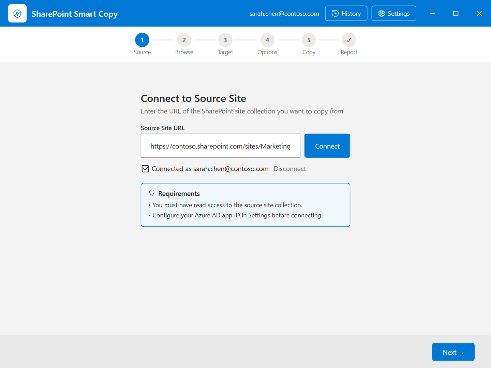
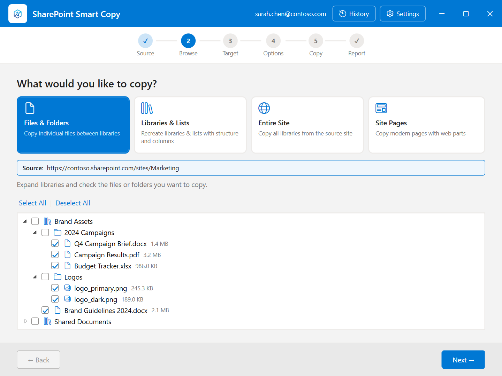
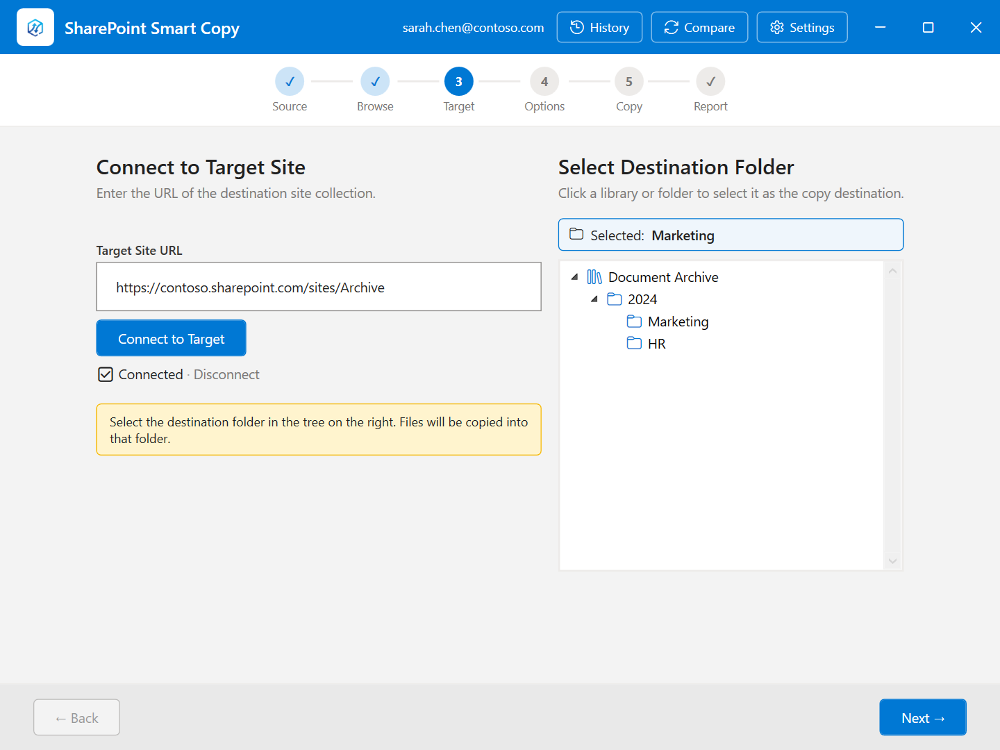
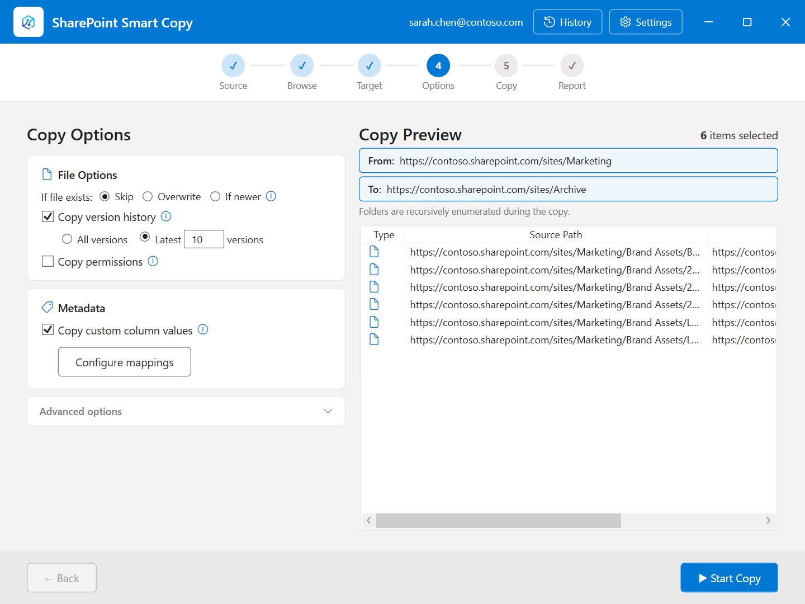
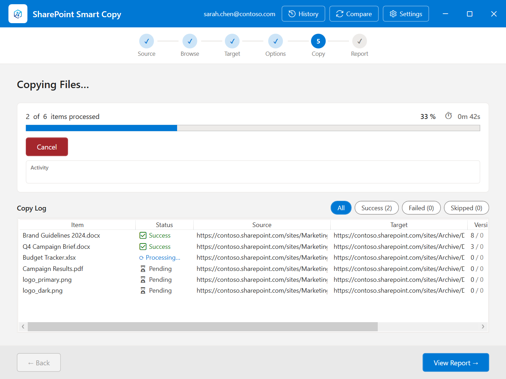
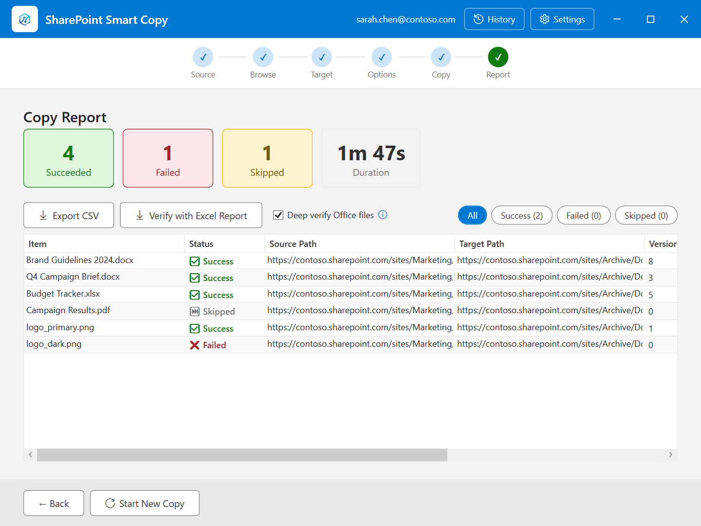
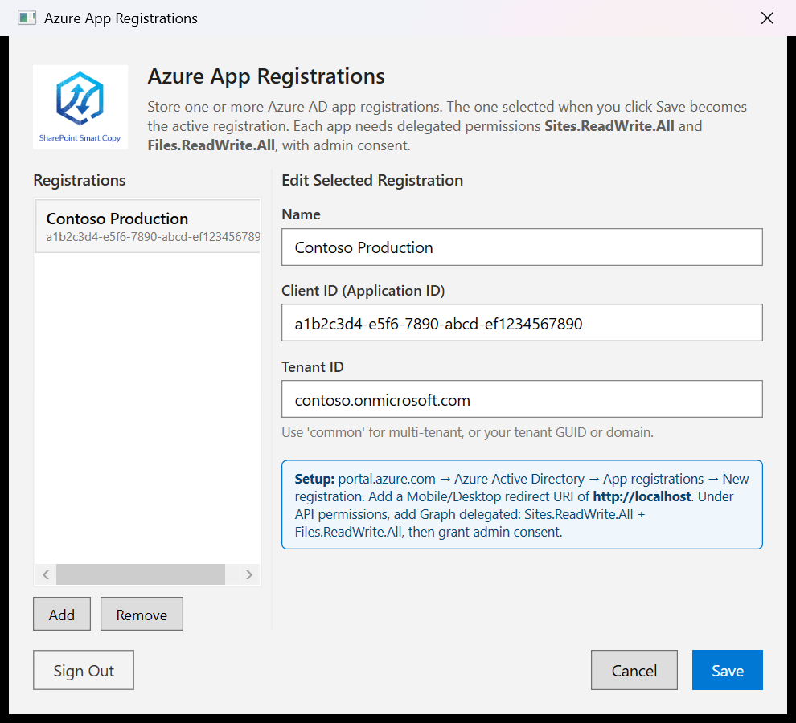
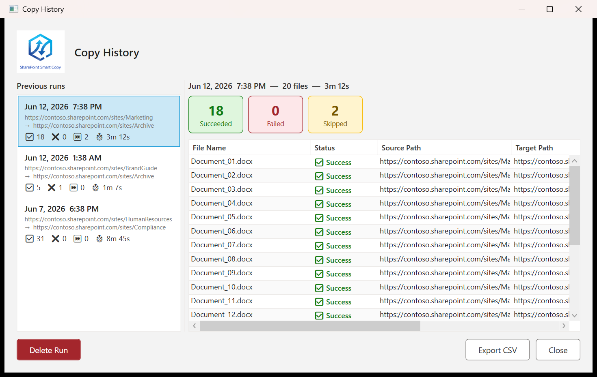

# SharePoint Smart Copy

A Windows desktop application for copying files and folders between SharePoint site collections, with full version history support and metadata preservation.

---

## Overview

SharePoint Smart Copy uses the Microsoft Graph API to migrate content between any two SharePoint Online site collections you have access to. It walks you through the process in six guided steps, preserves file metadata (created/modified dates and authors), and generates a detailed report when finished.

---

## Features

- **Cross-site-collection copies** — copy between any two SharePoint sites in the same or different tenants
- **Hierarchical selection** — browse document libraries, expand folders, and check exactly what to copy; checking a folder selects all its contents recursively
- **File version history** — optionally copies all previous versions oldest-first so version history builds naturally in the target
- **Version limit** — copy only the N most recent versions instead of the full history
- **Metadata preservation** — Created By, Created Date, Modified By, and Modified Date are applied to each file and folder
- **Overwrite control** — skip existing files or overwrite them
- **Parallel transfers** — configurable 1–16 parallel copies for throughput tuning
- **Live progress** — real-time file status list with elapsed time counter and progress bar
- **Copy report** — per-file success/fail/skipped summary with source and target paths and version counts
- **CSV export** — export any report to CSV for sharing or archiving
- **Copy History** — every run is saved locally; browse previous runs, view per-file detail, and export or delete entries
- **Multiple Azure AD registrations** — store and switch between multiple app registrations (useful for multi-tenant work)
- **Credential reuse** — starting a new copy reuses the existing authentication token; no extra sign-in required

---

## Installation

1. Go to the [Releases](https://github.com/sregan1/SharePointSmartCopy/releases/latest) page and download `SharePointSmartCopy-vX.X.X.zip`
2. Extract the zip to a folder of your choice (e.g. `C:\Tools\SharePointSmartCopy`)
3. Run `SharePointSmartCopy.exe` from that folder

No .NET installation required — the runtime is bundled in the zip.

> **Note:** Because the executable is not code-signed, Windows may show a SmartScreen warning on first run. Click **More info → Run anyway** to proceed.

---

## Requirements

- Windows 10 or 11
- An Azure AD app registration with:
  - **Sites.ReadWrite.All** (delegated)
  - **Files.ReadWrite.All** (delegated)
  - Admin consent granted
- Read access to the source site collection
- Write access to the target site collection

---

## Setup

1. Register an application in the [Azure portal](https://portal.azure.com) under **Azure Active Directory → App registrations**
2. Add the delegated permissions **Sites.ReadWrite.All** and **Files.ReadWrite.All** and grant admin consent
3. Open SharePoint Smart Copy and click **⚙ Settings**
4. Click **Add**, give the registration a name, and paste in your **Client ID** and **Tenant ID**
5. Click **Save**

---

## Step-by-Step Usage

### Step 1 — Connect to Source

Enter the URL of the SharePoint site you want to copy *from* and click **Connect**. The app authenticates via your browser (first run) or silently reuses a cached token on subsequent runs. When connected, your signed-in account is shown.

---

### Step 2 — Browse & Select

Expand document libraries and check the files and folders you want to copy. Checking a folder selects all its contents. Size information is shown next to each item. Use **Select All** / **Deselect All** for bulk selection.

---

### Step 3 — Connect to Target

Enter the URL of the destination SharePoint site and click **Connect to Target**. Once connected, the library tree on the right populates. Click any library or folder to choose it as the copy destination — the selected path appears in the blue banner at the top of the tree.

---

### Step 4 — Copy Options

Configure how the copy runs before starting:

| Option | Description |
|---|---|
| **Overwrite existing files** | Replace files that already exist in the target. When unchecked, existing files are skipped. |
| **Copy versions** | Upload the full version history, oldest-first, so history builds naturally in the target. |
| **Copy all versions** | When version copy is enabled, copies every version. Uncheck to limit to N most recent. |
| **Latest N versions** | Active when "Copy all versions" is unchecked — copies only the N most recent versions. |
| **Version strategy** | Controls how per-version metadata is handled (see below). |
| **Parallel copies** | Number of simultaneous file transfers (1–16). Higher values are faster but may throttle on large sites. |

**Version strategy** (visible when Copy versions is on):

| Strategy | Behaviour |
|---|---|
| **Preserve metadata for every version** | Every version in the target shows the source's original Modified date and author. Version numbers will be non-sequential (e.g. 2, 4, 6) due to a SharePoint API constraint. |
| **Keep version numbers sequential** | Versions are numbered 1, 2, 3… with no gaps. Only the latest version's metadata (date and author) is synced; intermediate versions show the copy date in version history. |

The **Copy Preview** table on the right lists every top-level item that will be copied and its destination.

---

### Step 5 — Copy in Progress

Click **Start Copy** to begin. The progress bar and file counter update in real time, along with an elapsed-time display. A scrollable table shows the status of each file as it completes. Click **Cancel** to stop mid-run; already-copied files remain in the target.

---

### Step 6 — Copy Report

When the copy finishes, click **View Report** to see the final summary. Color-coded stat cards show the count of succeeded, failed, and skipped files, alongside the total duration. The file table below lists every file with its source path, target path, status, and version count. Use **Export CSV** to save the report, or **Start New Copy** to begin another transfer without re-authenticating.

---

## Settings — Azure App Registrations

Click **⚙ Settings** from any screen to manage Azure AD app registrations. You can store multiple registrations and switch between them. The active registration is used for all Graph API calls. Click **Sign Out** to clear the cached authentication token.

---

## Copy History

Click **📋 History** from any screen to view all previous runs. Select a run to see its summary cards (succeeded / failed / skipped) and the full per-file detail on the right. Use **Export CSV** to export that run's report, or **Delete Run** to remove it. History is capped at 50 entries; older runs are pruned automatically.

---

## Technical Notes

- All API calls go through Microsoft Graph v5 using delegated (user) permissions — no application-level secrets are stored
- Authentication uses MSAL with a persistent token cache; interactive login is only required on first use
- Version uploads proceed oldest-first; each intermediate version gets its original timestamp patched immediately after upload so the timeline is accurate
- The current (latest) version is downloaded via the file content endpoint rather than the versions endpoint, which the Graph API blocks for the current version
- Folder metadata (created/modified dates and authors) is applied after all file copies in that folder complete
- Reports are saved as JSON files in `%AppData%\SharePointSmartCopy\Reports\`
